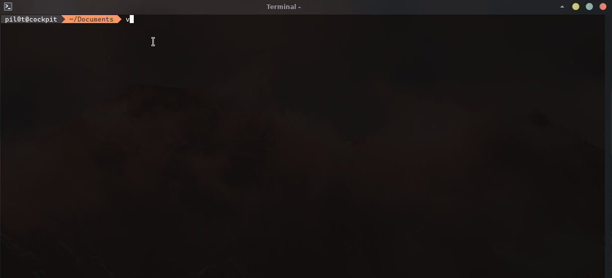

<!--
	This file is part of Ichigo.

	Ichigo is free software: you can redistribute it and/or modify
	it under the terms of the GNU General Public License as published by
	the Free Software Foundation, either version 3 of the License, or
	(at your option) any later version.

	Ichigo is distributed in the hope that it will be useful,
	but WITHOUT ANY WARRANTY; without even the implied warranty of
	MERCHANTABILITY or FITNESS FOR A PARTICULAR PURPOSE.  See the
	GNU General Public License for more details.

	You should have received a copy of the GNU General Public License
	along with Ichigo.  If not, see <https://www.gnu.org/licenses/>.
-->

<!-- PROJECT LOGO -->
<br />
<p align="center">
  <h1 align="center">Addlicense</h3>

  <p align="center">
    Add any license header on all files.
    <br />
    <a href="https://github.com/ichigoproject/addlicense"><strong>Explore the docs »</strong></a>
    <br />
    <br />
    <a href="https://github.com/ichigoproject/addlicense">View Demo</a>
    ·
    <a href="https://github.com/ichigoproject/addlicense/issues">Report Bug</a>
    ·
    <a href="https://github.com/ichigoproject/addlicense/issues">Request Feature</a>
  </p>
</p>

<!-- TABLE OF CONTENTS -->
<details open="open">
  <summary>Table of Contents</summary>
  <ol>
    <li>
      <a href="#about-the-project">About The Project</a></li>
    <li><a href="#install">Install</a></li>
    <li><a href="#usage">Usage</a></li>
    <li><a href="#License">License</a></li>
  </ol>
</details>

## About The Project

The program ensures source code files have copyright license headers
by scanning directory patterns recursively.

It modifies all source files in place and avoids adding a license header
to any file that already has one.

This project is an fork from 'addlicense' by Google Inc with GNU support.


## Install
For Debian/Ubuntu users:
```bash
sudo echo "deb [trusted=yes] https://repo.ichigoproject.org/apt/ /" > /etc/apt/sources.list.d/ichigo.list
sudo apt update
sudo apt install addlicense
```

For RHEL users:
```bash
sudo vi /etc/yum.repos.d/ichigo.repo

# Add this content in /etc/yum.repos.d/ichigo.repo 
[fury]
name=Ichigo Project official repository
baseurl=https://repo.ichigoproject.org/yum/
enabled=1
gpgcheck=0

sudo yum update
sudo yum install addlicense
```
## Usage
```
addlicense [flags] pattern [pattern ...]

-c copyright holder (defaults to "Ichigo Project")
-f custom license file (no default)
-l license type: apache, bsd, mit, mpl, gnu (defaults to "gnu")
-y year (defaults to current year)
-check check only mode: verify presence of license headers and exit with non-zero code if missing
```
The pattern argument can be provided multiple times, and may also refer
to single files.

### Example
Add "apache" license header on all files.
```
addlicense -l apache -c "My company" apache path/to/your/code/
```

Check if headers is present or not (in current directory):
```bash
addlicense -check .
```

## License
Distributed under the Apache 2.0 license. See [LICENSE](https://github.com/ichigoproject/addlicense/blob/main/LICENSE) for more information.